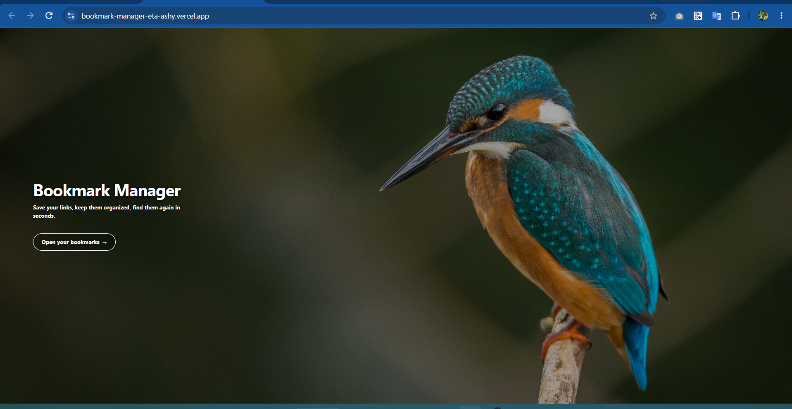
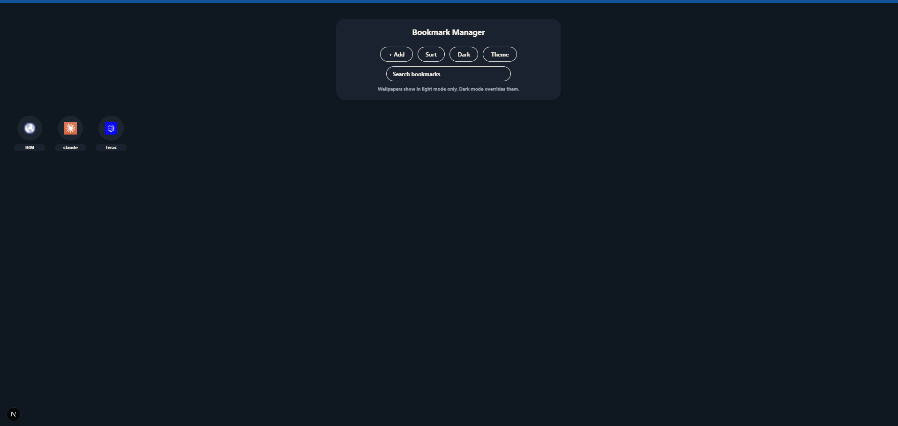
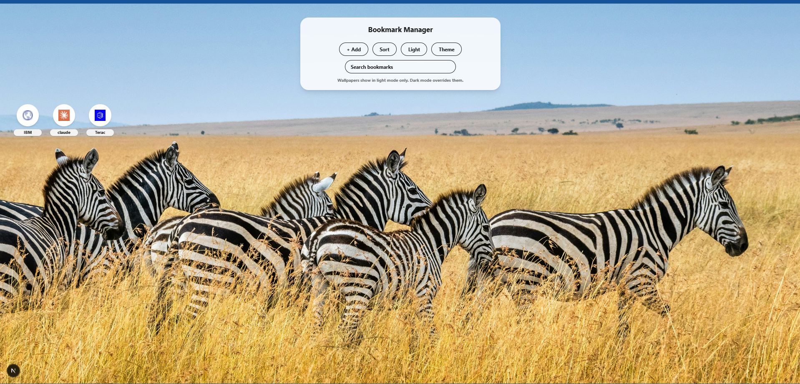
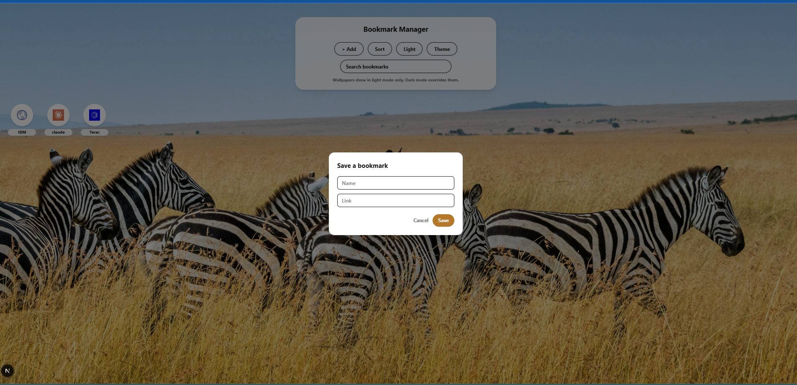
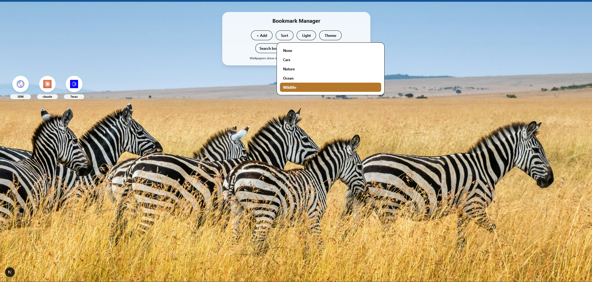

# Bookmark Manager

**Live demo:** https://bookmark-manager-eta-ashy.vercel.app/

A fast, minimal bookmark manager that lives entirely in your browser. Save links, mark favorites, search, sort, switch between dark/light mode, and pick a wallpaper — no account, no backend, no database. Everything is stored in `localStorage`.

## What this is (and isn't)

This is **not** a replacement for Chrome's (or any browser's) built-in bookmark manager, and it isn't trying to be — at least not at this stage of development. Keep saving your everyday bookmarks the normal way, directly in your browser.

Where this app helps is with **the bookmarks you want to keep a close eye on** — the ones that matter *right now* and shouldn't get buried. A browser's bookmarks bar is built for permanent, long-term links; the more you save there, the further any single one sinks down the list, and finding a specific link among hundreds becomes real friction.

Good candidates for tracking here:

- Job applications you're following up on
- Upcoming interview links or portals
- A platform or dashboard you check daily or weekly
- Anything time-sensitive you don't want to lose track of

You don't have to choose one or the other — plenty of people save the same link in both places: normally in Chrome for permanent safekeeping, and here for a focused, uncluttered view of what needs attention this week. Since this is still an early-stage project (no sync, no account, no cloud backup), treating your browser's bookmarks as the source of truth and this app as a lightweight "currently tracking" view is the safest way to use both together.

## Importing your Chrome bookmarks

You can bring your existing Chrome bookmarks into the app any time using the **Import** button — it reads a standard bookmarks export file and only adds links you don't already have here (no duplicates, and it never touches or deletes anything in Chrome itself).

**Step 1 — Export from Chrome:**

1. Open a new tab and go to `chrome://bookmarks`, or click the ⋮ menu → Bookmarks and lists → Bookmark manager
2. In the Bookmark Manager page, click the **⋮ (three-dot menu)** in its own top-right corner
3. Choose **Export bookmarks**
4. Save the `.html` file somewhere easy to find, like Downloads

**Step 2 — Import into Bookmark Manager:**

1. Open the app and click the **Import** pill
2. Select the `.html` file you just exported
3. You'll see a confirmation like "Added 12 new bookmarks" — or "No new bookmarks found" if everything was already here
4. Repeat this any time you've added new bookmarks in Chrome and want them reflected here too — it will only ever add what's new, never duplicate what's already saved

## Screenshots

| Home | Bookmarks (dark) | Bookmarks (light + wallpaper) |
| --- | --- | --- |
|  |  |  |

| Add / edit bookmark | Wallpaper picker |
| --- | --- |
|  |  |

## Features

- **Add, edit, delete bookmarks** — name + URL, with the URL auto-prefixed with `https://` if the scheme is missing.
- **Import from your browser** — export your Chrome bookmarks to HTML and import them here, deduplicated automatically.
- **Favicons fetched automatically** via Google's favicon service — no manual icon upload.
- **Favorites** — pin bookmarks to a dedicated section at the top of the grid.
- **Search** — filter by name or URL as you type.
- **Sort** — by date added, A–Z, or Z–A.
- **Dark / light theme toggle**, persisted across sessions.
- **Wallpaper backgrounds** — pick from curated categories (nature, ocean, cars, wildlife); wallpapers only render in light mode.
- **No backend** — all data lives in the browser's `localStorage`, so it's private to your device.

## Tech stack

- [Next.js 16](https://nextjs.org/) (App Router)
- [React 19](https://react.dev/)
- TypeScript
- [Tailwind CSS 4](https://tailwindcss.com/)
- [Vitest](https://vitest.dev/) + [Testing Library](https://testing-library.com/) for unit/component tests

## Getting started

    git clone https://github.com/davidtiger3622/bookmark_manager.git
    cd bookmark_manager
    npm install
    npm run dev

Open [http://localhost:3000](http://localhost:3000).

## Available scripts

| Script | Description |
| --- | --- |
| `npm run dev` | Start the local dev server |
| `npm run build` | Production build |
| `npm start` | Serve the production build |
| `npm run lint` | Run ESLint |
| `npm test` | Run the test suite once |
| `npm run test:watch` | Run tests in watch mode |
| `npm run test:coverage` | Run tests with coverage, enforcing the thresholds in `vitest.config.mts` |
| `npm run build-wallpaper-manifest` | Regenerate `public/wallpapers/manifest.json` after adding/removing wallpaper images |

## Testing & coverage

The suite covers every component and lib module. Coverage thresholds are enforced in `vitest.config.mts` — the SSR `typeof window === "undefined"` guards in `storage.ts`/`appearance.ts`/`bookmarkImport.ts` are the only intentionally-uncovered branches, since `window` always exists in the jsdom test environment. CI runs `npm run test:coverage` on every push and pull request to `main` and uploads the HTML report as a workflow artifact.

To view the report locally:

    npm run test:coverage
    open coverage/index.html

## Deploying to Vercel

This app is a standard Next.js project, so Vercel needs no extra configuration — a `vercel.json` is included for clarity, but Vercel auto-detects the framework, build command, and output.

**Option A — Git-based (recommended):**

1. Go to [vercel.com/new](https://vercel.com/new) and import `davidtiger3622/bookmark_manager`.
2. Vercel auto-detects Next.js — leave the defaults and click **Deploy**.
3. Every push to `main` redeploys automatically; every pull request gets its own preview URL.

**Option B — Vercel CLI:**

    npm install -g vercel
    vercel login
    vercel        # deploy a preview
    vercel --prod # deploy to production

No environment variables are required — the app has no server-side secrets or external API keys.

## Project structure

    src/
      app/            # Next.js App Router pages (/, /bookmarks)
      components/     # UI components (grid, modal, menus, toggle, import button)
      lib/            # storage.ts, favicon.ts, appearance.ts, bookmarkImport.ts — all client-side logic
    public/
      wallpapers/     # wallpaper images + generated manifest.json
    scripts/
      rename-wallpapers.js  # regenerates the wallpaper manifest

## License

MIT — see [LICENSE](LICENSE).
